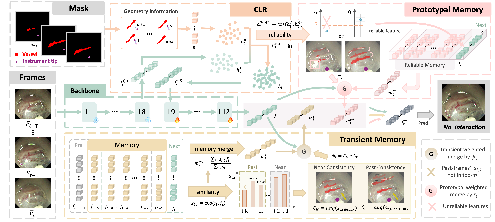

# EndoInteractionAnticipation
[MICCAI'26] From Perception to Anticipation: Forecasting Vessel–Instrument Interactions in Endoscopic Surgery under Unreliable Observations

---

## Introduction

This repository will provide the official PyTorch implementation of our MICCAI 2026 paper:

**From Perception to Anticipation: Forecasting Vessel–Instrument Interactions in Endoscopic Surgery under Unreliable Observations**

<p align="center">
  
</p>

Timely anticipation of vessel–instrument interactions is critical for improving surgical safety in Endoscopic Submucosal Dissection (ESD). Existing computer-assisted systems mainly rely on vessel segmentation, which provides spatial awareness but cannot predict hazardous interactions before they occur. Furthermore, segmentation errors caused by bleeding, specular reflections, and tissue deformation introduce unreliable observations, making anticipation particularly challenging.

In this work, we introduce **vessel–instrument interaction anticipation**, a new task that predicts future interaction states from a short observation window of surgical video and segmentation masks.

To address unreliable observations, our method consists of two key components:

* **Cross-Modal Latent Recovery (CLR)**
  Learns a shared latent representation by enforcing consistency between visual appearance and geometric observations, reducing the impact of noisy segmentation.

* **Dual Asynchronous Memory (DAM)**
  Separates transient interaction dynamics from reliability-filtered long-term prototypes, enabling robust temporal reasoning under heterogeneous temporal evidence.

Together, these components enable reliable anticipation of future vessel–instrument interactions for real-time surgical safety assistance.

---

## Results

Our method achieves state-of-the-art performance on the proposed ESD interaction anticipation benchmark:

* **Macro F1:** 70.80%
* **Precision:** 71.34%
* **Recall:** 71.52%
* **Accuracy:** 71.11%
* **Inference Speed:** 97.82 FPS

Compared with strong visual and geometry-based baselines, our method:

* Improves robustness under unreliable observations
* Learns category-specific temporal evidence distributions
* Anticipates vessel–instrument contact before actual interaction

---

## Usage

🚧 Code coming soon.

---

## Contact

For any questions, please contact:

**Yueyao Chen**
📧 [yueyaochen0823@gmail.com](mailto:yueyaochen0823@gmail.com)

---

## Citation

If you find this work useful, please cite:

```bibtex
@inproceedings{chen2026anticipation,
  title={From Perception to Anticipation: Forecasting Vessel--Instrument Interactions in Endoscopic Surgery under Unreliable Observations},
  author={Chen, Yueyao and Wang, Kai-Ni and Yip, Hon-Chi and Dou, Qi},
  booktitle={International Conference on Medical Image Computing and Computer-Assisted Intervention (MICCAI)},
  year={2026}
}
```
